# Planning and Action Items

## RAG Pipeline Improvements (2025-05-09)

Our debugging revealed that the most significant issue with semantic search quality is not in the similarity calculation mechanism or model selection, but in how document content is chunked and embedded. The following architectural improvements should be considered:

### Chunking Strategy

*   **Severity: High**
    Current chunking approach produces chunks that are too large and contain mixed topics, diluting the semantic signal for specific queries.
    **Evidence:** Specific targeted sentences about a topic achieved ~0.63 similarity with relevant queries, while the full chunks only achieved ~0.24 similarity.
    **Action:** Implement configurable chunking strategies via environment variables:
    ```
    CHUNK_SIZE=1000             # Default character count per chunk
    CHUNK_OVERLAP=200           # Default overlap between chunks
    CHUNK_STRATEGY="paragraph"  # Options: paragraph, sentence, fixed
    ```

*   **Severity: Medium**
    Consider semantic chunking that breaks documents at natural topic boundaries rather than fixed character counts.
    **Action:** Add an optional LLM-based chunking strategy that can identify topic boundaries within documents.
    ```
    SEMANTIC_CHUNKING=false     # Whether to use LLM to identify logical chunk boundaries
    ```

#### Detailed Implementation Plan for Configurable and Semantic Chunking (2025-05-09)

**Overall Goal:** Modify the system to use configurable chunking strategies (`fixed`, `paragraph`, `sentence`, `semantic`) with adjustable chunk size and overlap, driven by environment variables. Semantic chunking will be the preferred method if enabled.

**Phase 1: Implement Core Chunking Logic & Settings**

**Step 1: Update Application Settings ([`src/utils.py`](src/utils.py))**

1.  **Update `ChunkStrategy` Enum:**
    Add `SEMANTIC` to the `ChunkStrategy` Enum.
    ```python
    # In src/utils.py
    from enum import Enum

    class ChunkStrategy(str, Enum):
        PARAGRAPH = "paragraph"
        SENTENCE = "sentence"
        FIXED = "fixed"
        SEMANTIC = "semantic" # New
    ```

2.  **Add/Update Chunking Configuration Fields in `Settings` Class:**
    Add `SEMANTIC_CHUNKING` as per [`PLANNING.md`](PLANNING.md). The existing `LLM_ENABLED`, `LLM_API_KEY`, etc., will be used by semantic chunking.
    ```python
    # Modify Settings class in src/utils.py
    class Settings(BaseSettings):
        # ... other settings ...
        CHUNK_SIZE: int = 1000
        CHUNK_OVERLAP: int = 200
        CHUNK_STRATEGY: ChunkStrategy = ChunkStrategy.PARAGRAPH # Default if SEMANTIC_CHUNKING is false
        SEMANTIC_CHUNKING: bool = False # New, as per PLANNING.md

        LLM_ENABLED: bool = False
        LLM_API_KEY: Optional[str] = None
        LLM_BASE_URL: Optional[HttpUrl] = None
        LLM_MODEL_NAME: Optional[str] = None
        # ... model_config and validator ...
    ```

**Step 2: Implement New Chunking Logic ([`src/crawler/web_crawler.py`](src/crawler/web_crawler.py))**

1.  **Import Necessary Modules:**
    Add imports for `httpx`, `json`, `settings`, `ChunkStrategy`.
    ```python
    # At the top of src/crawler/web_crawler.py
    import httpx # For async LLM calls
    import json
    from ..utils import settings, ChunkStrategy
    ```

2.  **Implement Helper Functions for Rule-Based Chunking (Synchronous):**
    *   `_fixed_char_chunking(text: str, size: int, overlap: int) -> List[str]`
    *   `_paragraph_chunking(text: str, size: int, overlap: int) -> List[str]`
    *   `_sentence_chunking(text: str, size: int, overlap: int) -> List[str]`

3.  **Implement `_semantic_chunking` Helper Function (Asynchronous):**
    Calls LLM to get semantic chunks. Includes logic for:
    *   Checking LLM configuration.
    *   Fallback to `_paragraph_chunking` if LLM fails or is not configured.
    *   Prompt engineering for JSON list output.
    *   Error handling for API calls and response parsing.
    *   Sub-chunking overly large LLM-generated chunks using `_fixed_char_chunking`.
    ```python
    async def _semantic_chunking(text: str, fallback_size: int, fallback_overlap: int) -> List[str]:
        # ... (implementation details omitted for brevity in this plan summary) ...
        # Key aspects:
        # - Construct prompt for LLM to return JSON list of semantic text chunks.
        # - Make async HTTP call to LLM_BASE_URL.
        # - Parse JSON response.
        # - Handle errors and fall back to _paragraph_chunking.
        # - If an LLM-generated chunk is too large (e.g., > 1.5 * fallback_size),
        #   sub-chunk it using _fixed_char_chunking.
        pass # Placeholder for actual implementation
    ```

4.  **Refactor `smart_chunk_markdown` to `chunk_text_according_to_settings` (Asynchronous):**
    Prioritizes semantic chunking if `settings.SEMANTIC_CHUNKING` is true. Otherwise, uses rule-based strategy from `settings.CHUNK_STRATEGY`.
    ```python
    async def chunk_text_according_to_settings(text: str) -> List[str]: # Now async
        # ... (implementation details omitted for brevity) ...
        # Key aspects:
        # - Read settings.SEMANTIC_CHUNKING, settings.CHUNK_STRATEGY, etc.
        # - If SEMANTIC_CHUNKING is true, await _semantic_chunking.
        # - Else, call appropriate rule-based chunker (_fixed_char_chunking, _paragraph_chunking, _sentence_chunking).
        pass # Placeholder for actual implementation
    ```

**Step 3: Update Callers of the Chunking Logic**

*   **Modify [`src/crawler/postgres_client.py`](src/crawler/postgres_client.py):**
    1.  Change import from `smart_chunk_markdown` to `chunk_text_according_to_settings`.
    2.  Make `store_crawled_documents` an `async def` function.
    3.  Replace `chunks = smart_chunk_markdown(...)` with `chunks = await chunk_text_according_to_settings(markdown_content)`.
    4.  Remove `default_chunk_size` parameter from `store_crawled_documents`.

*   **Modify [`src/crawler/tool_definitions.py`](src/crawler/tool_definitions.py):**
    1.  In `crawl_single_page` (async):
        *   Change import to `chunk_text_according_to_settings`.
        *   Replace `chunks = smart_chunk_markdown(...)` with `chunks = await chunk_text_according_to_settings(result.markdown)`.
    2.  In `smart_crawl_url` (async):
        *   Ensure `store_crawled_documents` is awaited: `await store_crawled_documents(...)`.
        *   Remove `default_chunk_size` argument from the `store_crawled_documents` call.

**Phase 2: Testing**

**Step 4: Write Unit Tests ([`tests/`](tests/))**

1.  **Create `tests/crawler/test_web_crawler_chunking.py`**.
2.  **Test `_fixed_char_chunking`**.
3.  **Test `_paragraph_chunking`**.
4.  **Test `_sentence_chunking`**.
5.  **Test `_semantic_chunking` (Async):**
    *   Mock `httpx.AsyncClient.post` for LLM API responses.
    *   Mock `src.utils.settings` for LLM config.
    *   Test success, failures, fallbacks, input truncation, sub-chunking.
6.  **Test `chunk_text_according_to_settings` (Async):**
    *   Mock `src.utils.settings` for strategies and LLM config.
    *   Verify correct helper calls and fallbacks.

**Phase 3: Documentation & Cleanup**
*   Update docstrings and comments.
*   Deprecate/remove old `smart_chunk_markdown`.

**Mermaid Diagram:**

```mermaid
graph TD
    subgraph "Settings (src/utils.py)"
        direction LR
        S["Settings Class"] -- reads --> EnvVars["Environment Variables (.env)"]
        S -- defines --> CS["CHUNK_STRATEGY Enum: paragraph, sentence, fixed, semantic"]
        S -- defines --> CZ["CHUNK_SIZE"]
        S -- defines --> CO["CHUNK_OVERLAP"]
        S -- defines --> SCEnabled["SEMANTIC_CHUNKING bool"]
        S -- defines --> LLMConf["LLM_BASE_URL, LLM_API_KEY, LLM_MODEL_NAME"]
    end

    subgraph "Crawler Logic (src/crawler/web_crawler.py)"
        direction LR
        CTAS["chunk_text_according_to_settings (async)"] -- uses --> S
        CTAS -- "calls if SEMANTIC_CHUNKING true" --> SemChunk["_semantic_chunking (async)"]
        SemChunk -- calls --> LLMAPI["LLM API (via httpx)"]
        SemChunk -- "calls on fallback/sub-chunk" --> PC["_paragraph_chunking"]
        SemChunk -- "calls on sub-chunk" --> FCC["_fixed_char_chunking"]
        CTAS -- "calls if rule-based" --> FCC
        CTAS -- "calls if rule-based" --> PC
        CTAS -- "calls if rule-based" --> SC["_sentence_chunking"]
        SC -- uses --> NLTK["nltk.sent_tokenize"]
    end

    subgraph "Callers"
        direction LR
        PGClientFunc["store_crawled_documents (async) in src/crawler/postgres_client.py"] -- "await calls" --> CTAS
        ToolDefCrawlSingle["crawl_single_page (async) in src/crawler/tool_definitions.py"] -- "await calls" --> CTAS
        ToolDefSmartCrawl["smart_crawl_url (async) in src/crawler/tool_definitions.py"] -- "await calls" --> PGClientFunc
    end

    subgraph "Database (src/utils.py)"
        direction LR
        ADDB["add_documents_to_db"] -- "receives chunks from" --> PGClientFunc
    end

    EnvVars --> S
    S --> CTAS
    CTAS --> PGClientFunc
    CTAS --> ToolDefCrawlSingle
    PGClientFunc --> ADDB
    ToolDefSmartCrawl --> PGClientFunc

    style S fill:#f9f,stroke:#333,stroke-width:2px
    style CTAS fill:#ccf,stroke:#333,stroke-width:2px
    style SemChunk fill:#cff,stroke:#333,stroke-width:1px
    style FCC fill:#lightgrey,stroke:#333,stroke-width:1px
    style PC fill:#lightgrey,stroke:#333,stroke-width:1px
    style SC fill:#lightgrey,stroke:#333,stroke-width:1px
```

### Retrieval Process

*   **Severity: Medium**
    Single-vector dense retrieval sometimes misses relevant chunks due to vocabulary mismatch.
    **Action:** Add optional hybrid retrieval combining:
    - Dense vector search for semantic similarity
    - Optional lightweight keyword-based pre-filtering
    ```
    HYBRID_SEARCH=false         # Whether to combine keyword and vector search
    KEYWORD_WEIGHT=0.3          # Weight of keyword match vs vector similarity
    ```

*   **Severity: Low**
    Consider query expansion techniques that transform simple user queries into more robust search vectors.
    **Action:** Implement optional query expansion via prompt templates:
    ```
    QUERY_EXPANSION=false       # Whether to expand queries with additional context
    ```